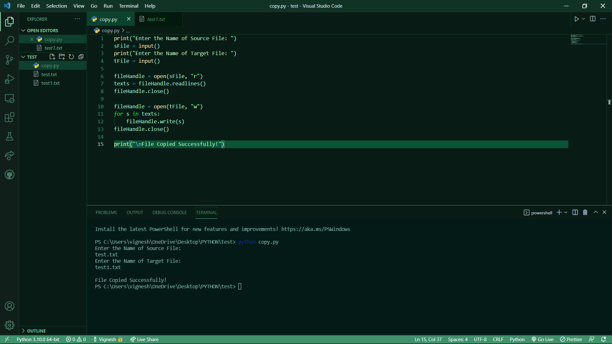

# copy-file
## AIM:
To write a python program for copying the contents from one file to another file.
## EQUIPEMENT'S REQUIRED: 
PC
Anaconda - Python 3.7
## ALGORITHM: 
### Step 1:
Get the file name and location from the user
### Step 2: 
 Give a new file name to create a copy of a file content
### Step 3: 
Read the file and close the file
### Step 4:  
Now write the content in the new file
### Step 5: 
When done print "File copied successfully"
### Step 6: 
End of the program
## PROGRAM:
~~~
''' 
program for copying the contents
Developed by: M VIGNESH
RegisterNumber: 21004061
'''
print("Enter the Name of Source File: ")
sFile = input()
print("Enter the Name of Target File: ")
tFile = input()

fileHandle = open(sFile, "r")
texts = fileHandle.readlines()
fileHandle.close()

fileHandle = open(tFile, "w")
for s in texts:
    fileHandle.write(s)
fileHandle.close()

print("\nFile Copied Successfully!")
~~~

### OUTPUT:

## RESULT:
Thus the program is written to copy the contents from one file to another file.